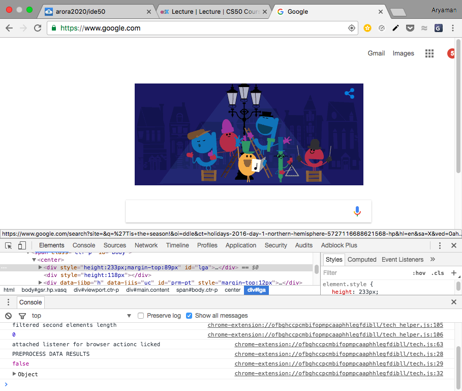
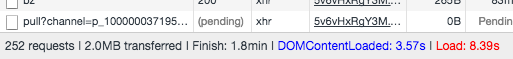
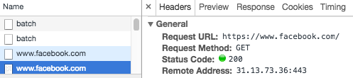

## `GET` (requests)

```
GET / HTTP/1.1
Host: www.google.com
...
```

`/` represents the index page, the home page; the default page. The page responds with:

```
HTTP/1.1 200 OK
Content-Type: text/html
```

## Chrome's Inspect Tool

### Network

Chrome has some pretty nifty debugging tools that we can use for looking at HTML and CSS, and other programming languages, that are on a site.



The *network* tab can be used to see what requests our browser is making. Going to the http://www.facebook.com/ login page results in a whopping 41 packets received. Mine is a bit different because I'm logged in...



Here's that very first `GET` request:



Lots of key-value pairs. The envelopes that are sent back are all HTML!

### Page Source
You can see the page source also, which contains the underlying HTML.

We'll notice lots of `<>` and `</>`, and `<head>` and `<body>`. Remember this?

```html
<!DOCTYPE html>

<html>
    <head>
        <title>hello, world</title>
    </head>
    <body>
        hello, world
    </body>
</html>
```

Looks nice, right? Facebook's is not. This is because whitespace costs data; a spacebar is a byte. If a billion people go to Facebook, that's a billion bytes sent out, a whole gig of data. This "obfuscation" is called **minifying**. Chrome can clean it up in the elements tab.

## `html` Files

If you make an `html` file on your computer, you are the only person that can access it. If you want other people to see it on the internet, you have to use a web server. Cloud9 and GitHub have these for free!

In Cloud9:

```bash
apache50 start .
```

This is how you can have public websites! When you host on CS50 IDE, you get a subdomain of CS50's domain, [cs50.io](http://www.cs50.io).

### Tags
`HTML` is all about tags.

| Tag        | Meaning   |
| :--------- | :-------- |
| `<p>`      | paragraph |
| `<h#>`     | heading   |
| `<ul>`     | unordered list |
| `<ol>`     | ordered list |
| `<li>`     | list item |
| ``   | image     |
| `<iframe>` | video, page |
| `<div>`    | division |

You can reference local or remote files.

## CSS

**CSS** (Cascading Style Sheets) are used for styling HTMl pages. They can be intermingled in one document, as in `css-0.html`.

CSS is just key value pairs, like so:

```
color: red;
background-color: green;
```

This is where `<style>` tags come in.

```css
body
{
  text-align: center;
  background-color: blue;
}

#top
{
  color: red;
  font-size: 36px;
  font-weight: bold;
}

#middle
{
  font-size: 24px;
}

#bottom
{
  color: blue;
  font-size: 12px;
}
```

This will go in the `<head>`. Or, we can have a separate `.css` file and use `<link>` to include it. This is better design, because it's more flexible.

## Dynamic Sites
Soon, we'll learn PHP!
